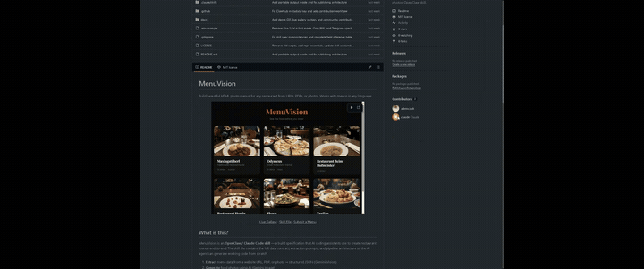

# CursorCast

> Chrome extension that records your tab with an emulated cursor and auto-zoom on clicks. Includes a Remotion post-processor for studio-quality output with wallpaper backgrounds, floating windows, and spring-animated zoom.

<p align="center">
  
</p>

## Two Modes

### 1. Real-Time Recording (Chrome Extension)

Records directly to MP4 with zoom and cursor baked in. Quick and simple — click Record, interact, click Stop, save.

### 2. Post-Processing (Remotion Pipeline)

Records raw video + cursor telemetry JSON, then renders a polished video with:
- Gradient wallpaper backgrounds (8 presets)
- Floating window with rounded corners and layered drop shadows
- Spring-animated zoom transitions on click clusters
- Emulated arrow cursor with click-pulse ripple
- Professional H.264 MP4 via FFmpeg

The key difference: post-processing is **non-destructive** — you can change the wallpaper, adjust zoom regions, and tweak the cursor style *after* recording.

## Install

```bash
git clone https://github.com/ademczuk/cursorcast.git
```

### Chrome Extension
1. Open `chrome://extensions`
2. Enable **Developer mode** (top right toggle)
3. Click **Load unpacked** and select the cloned `cursorcast/` folder
4. Pin the extension in the toolbar

### Remotion Post-Processor (optional)
```bash
cd cursorcast/remotion
npm install
```

## Usage

### Quick Recording (Extension Only)
1. Navigate to the tab you want to record
2. Click the CursorCast icon in the toolbar
3. Adjust settings (zoom depth, cursor on/off, cursor size)
4. Click **Record**
5. Interact with the page — clicks trigger auto-zoom
6. Click the extension icon again and click **Stop**
7. Save the MP4 file + telemetry JSON (auto-downloaded)

### Studio-Quality Export (Remotion)
1. Record as above — you'll get `cursorcast-{timestamp}.mp4` and `cursorcast-{timestamp}-telemetry.json`
2. Copy both files to `remotion/public/` (rename the video to `recording.mp4`)
3. Preview in Remotion Studio:
   ```bash
   cd remotion
   npx remotion studio
   ```
4. Render the final video:
   ```bash
   npx remotion render src/index.ts ScreenRecording out/final.mp4 \
     --props='{"videoSrc":"recording.mp4","cursorData":[...],"zoomEvents":[...],"background":"linear-gradient(135deg, #667eea 0%, #764ba2 100%)"}'
   ```
   Or use the CLI helper:
   ```bash
   npx tsx render.ts --video recording.mp4 --telemetry telemetry.json --output final.mp4 --background purple-haze
   ```

### Wallpaper Presets

| Name | Gradient |
|------|----------|
| `purple-haze` | Purple to blue (default) |
| `ocean-breeze` | Blue to teal |
| `sunset-glow` | Pink to cyan to green |
| `midnight` | Dark navy to purple |
| `warm-flame` | Pink to peach |
| `aurora` | Cyan to green |
| `dark-slate` | Dark blue to navy |
| `candy` | Pink to red |

## Architecture

```
Chrome Extension (real-time recording):

  content.js (mouse tracker, injected into tab)
      │
      ▼
  background.js (service worker, message relay + telemetry collection)
      │
      ├──▶ offscreen.js (compositing engine + MediaRecorder → .mp4)
      │
      └──▶ telemetry.json (cursor positions + auto-detected zoom events)


Remotion Post-Processor (studio-quality export):

  recording.mp4 + telemetry.json
      │
      ▼
  ScreenRecording composition (React)
      │
      ├── WallpaperBackground (static gradient)
      ├── FloatingWindow (OffthreadVideo + CSS zoom transform + shadow)
      └── CursorOverlay (SVG arrow + click-pulse ripple)
      │
      ▼
  renderMedia() → H.264 MP4 via headless Chrome + FFmpeg
```

## Settings (Extension)

| Setting | Range | Default | Description |
|---------|-------|---------|-------------|
| Zoom | 1.5x / 2x / 3x | 2x | Maximum zoom level on click clusters |
| Cursor | on/off | on | Show emulated cursor in recording |
| Size | 0.8 - 3.5 | 1.8 | Cursor size multiplier |

## Settings (Remotion)

| Setting | Flag | Default | Description |
|---------|------|---------|-------------|
| Background | `--background` | `purple-haze` | Wallpaper preset name or CSS gradient |
| Padding | `--padding` | `48` | Padding around floating window (px) |
| Border Radius | `--radius` | `12` | Corner rounding (px) |
| Cursor Size | `--cursor-size` | `1.0` | Cursor size multiplier |
| No Cursor | `--no-cursor` | off | Disable cursor overlay |
| Resolution | `--width` / `--height` | 1920x1080 | Output dimensions |
| FPS | `--fps` | 30 | Output frame rate |

## Tech Stack

- **Extension**: Chrome MV3, tabCapture API, offscreen documents, canvas 2D, MediaRecorder
- **Physics**: Damped harmonic oscillator springs (cursor smoothing + zoom transitions)
- **Post-processor**: [Remotion](https://remotion.dev) 4, React 18, OffthreadVideo, FFmpeg
- **Ported from**: Spring physics from open-screenstudio, cursor rendering from CursorLens
